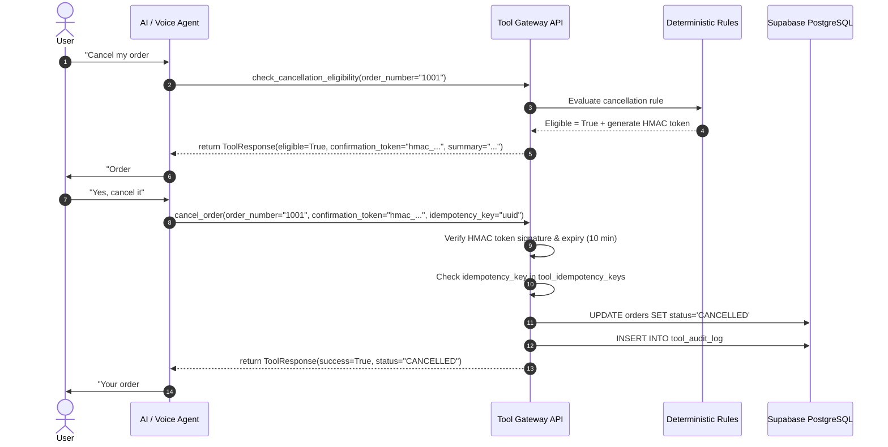

# Zara AI Retail Assistant & Tool Gateway: Complete Codex Handoff Package

> **Handoff Target**: Autonomous Coding Agent (Codex)  
> **Status**: Verified & Production-Ready at Phase 2C Completion  
> **Repository Commit**: `701bae1` (child of `8b9998e`)  
> **Branch**: `main`  
> **Working Tree**: 100% Clean (0 untracked files, 0 uncommitted modifications)  
> **Test Baseline**: 83 / 83 Passing (`OK`)  
> **Next Immediate Phase**: Phase 2D — Official Zara US Policy Knowledge Corpus, RAG (pgvector), & Rules Discrepancy Audit  

---

## 1. Current Verified Project State

- **Branch**: `main` (tracking `origin/main`, ahead by 2 verified commits).
- **Current HEAD**: `701bae1f9b5c571ab352467d165683933c06173c` (`701bae1`).
- **HEAD Commit Message**: `chore(backend): synchronize Phase 2C working tree and normalize file endings`
- **Recent Important Commits**:
  - `701bae1` — Post-recovery working tree synchronization and line-ending normalization.
  - `8b9998e` — `feat(backend): implement Phase 2C backend domain services and AI tool gateway`
  - `dfc8805` — `feat(supabase): implement Phase 2B synthetic operational data layer`
  - `b4dc703` — `feat(phase-2a): complete live Supabase catalogue import and verification`
  - `34da904` — `feat(phase-2a): define Supabase schema, migrations, RLS policies, and bulk import pipeline with dry-run validation`
  - `510d0be` — `feat(phase-1d): complete final catalogue audit and import readiness report`
  - `a97d679` — `feat(phase-1c): complete large-scale catalogue enrichment with final Phase 1C report`
- **Git Working Tree**: Verified clean. 6,368 tracked files match `git ls-tree` with zero discrepancies.
- **Test Suite**: 83/83 unit and integration tests passing in 11.5s via `python -m unittest discover tests`.
- **Live Supabase Connectivity**: Verified active and healthy via `SUPABASE_DB_URL` (direct PostgreSQL connection pooling) and `SUPABASE_URL` + `SUPABASE_SERVICE_ROLE_KEY`.

---

## 2. Phase History & Architectural Progression

### Phase 1A — Catalogue Discovery & Classification
- **Objective**: Discover, map, and classify Zara US online store taxonomy across Women, Men, and Kids departments.
- **Implementation**: Explored category trees, identified grid layouts, resolved card ID systems, and established URL patterns.
- **Key Outcome**: Comprehensive mapping of Zara US navigation hierarchies and product classifications.

### Phase 1B — Catalogue Enumeration
- **Objective**: Exhaustively enumerate product identities and canonical URLs.
- **Implementation**: Discovered and normalized product links across all categories into a deduplicated queue.
- **Key Outcome**: 6,276 unique product identities catalogued in sync queue.

### Phase 1C — Large-Scale Zara US Product Enrichment
- **Final Commit**: `a97d679`
- **Objective**: Enrich 6,276 queue items with deep product metadata using headless browser automation.
- **Implementation**: 3-layer architecture with 4 concurrent Playwright workers (Config D) in headed Edge context. Attached JSON-LD readiness, blocked unnecessary media/font binaries, captured atomic `page.content()`, and parsed offline via BeautifulSoup + JSON.
- **Key Outcome**: 6,017 COMPLETE products, 258 FAILED_TERMINAL (404/delisted), 1 FAILED_RETRYABLE, 0 QUEUED. Over 37,900 variants, 7,700 colors, and 40,200 images extracted.

### Phase 1D — Final Catalogue Audit & Import Readiness
- **Final Commit**: `510d0be`
- **Objective**: Comprehensive integrity and structural audit of normalized catalogue datasets prior to database ingestion.
- **Implementation**: Audited 100% ID consistency, foreign keys, price coverage (99.98%), and verified zero orphan variants, colors, images, or categories.
- **Decision**: Formally approved `READY_FOR_SUPABASE_IMPORT`.

### Phase 2A — Supabase Catalogue Schema & Live Import Pipeline
- **Final Commits**: `34da904`, `b4dc703`
- **Objective**: Establish production PostgreSQL relational schema and execute high-throughput bulk import into live Supabase.
- **Implementation**:
  - Migrations: `001_catalogue_schema.sql` (8 tables), `002_catalogue_indexes.sql` (B-tree, GIN full-text search), `003_catalogue_rls.sql` (public read access).
  - Bulk Importer: `scripts/supabase/import_catalogue.py` with multi-row batch upserts and live foreign key validation.
- **Key Outcome**: Verified exact row counts (6,018 products, 745 categories, 38,002 variants, 7,717 colors, 40,228 images, 8,200 product categories, 6,018 price histories, 6,276 sync state records). Zero relational integrity violations.

### Phase 2B — Synthetic Operational Data Layer
- **Final Commit**: `dfc8805`
- **Objective**: Create a realistic, internally consistent retail operations layer for e-commerce shopping, inventory lookups, order tracking, and customer service flows.
- **Implementation**:
  - Migrations: `004_operational_schema.sql`, `005_operational_indexes.sql`, `006_operational_rls.sql` (authenticated/internal only).
  - Strict Provenance: Every operational record carries `is_synthetic = TRUE` and `data_origin = 'synthetic'`.
  - Realistic Seed Generation: 30 US retail stores with coordinates, 117,258 SKU-store inventory records, 2,000 realistic customer profiles, 5,000 orders (12,500 line items), 5,000 payments, 4,250 multi-carrier shipments with 20,250 tracking events, 750 returns, 615 refunds, 102 exchanges.

### Phase 2C — Backend Domain Services & AI Tool Gateway
- **Final Commits**: `8b9998e`, `701bae1`
- **Objective**: Build a high-performance, deterministic backend gateway providing safe, validated business operations for future AI and voice agents.
- **Implementation**:
  - FastAPI Application (`backend/app/main.py`) with thread-safe connection pooling (`ThreadedConnectionPool`).
  - 14 AI-callable tools across Catalogue, Inventory, Stores, Orders, Tracking, Cancellations, Returns, Refunds, and Exchanges.
  - Deterministic Business Rules (`backend/app/rules/`): Order cancellation windows (30 min), Return windows (30 days), Item conditions, Exchange stock validation.
  - HMAC-SHA256 Confirmation Protocol: Mutating operations (`cancel_order`, `create_return`) issue cryptographic tokens during eligibility evaluation that must be presented upon execution.
  - Write Idempotency: `tool_idempotency_keys` prevents duplicate processing.
  - Comprehensive Audit Logging: Every request logged to `tool_audit_log` with microsecond duration and error codes.
  - Migration: `007_tool_gateway_schema.sql` applied to live database.
  - Performance: Verified p50 latencies between 172ms and 378ms across all 14 tools.

---

## 3. Authoritative Data Architecture & Provenance Isolation

```
┌──────────────────────────────────────────────────────────────────────────┐
│                   REAL PUBLIC ZARA US CATALOGUE LAYER                    │
│   (Extracted from public zara.com/us/en store — Read-Only & Immutable)    │
│                                                                          │
│   • products (6,018)              • categories (745)                     │
│   • product_variants (38,002)     • product_colors (7,717)               │
│   • product_images (40,228)       • product_categories (8,200)           │
│   • product_price_history (6,018) • catalogue_sync_state (6,276)         │
│                                                                          │
│   RULES:                                                                 │
│   1. Sourced strictly from live website observations.                    │
│   2. NEVER fabricate, alter, or insert synthetic items into catalogue.   │
│   3. Public Read RLS enabled.                                            │
└────────────────────────────────────┬─────────────────────────────────────┘
                                     │ Referenced via product_id/variant_id
                                     ▼
┌──────────────────────────────────────────────────────────────────────────┐
│                     SYNTHETIC OPERATIONAL DATA LAYER                     │
│               (Explicitly Generated for Retail Workflow Demo)            │
│                                                                          │
│   • stores (30)                   • inventory_levels (117,258)           │
│   • customers (2,000)             • customer_addresses (2,500)           │
│   • orders (5,000)                • order_items (12,500)                 │
│   • payments (5,000)              • shipments (4,250)                    │
│   • shipment_events (20,250)      • returns (757)                        │
│   • return_items (1,679)          • refunds (615)                        │
│   • exchanges (102)                                                      │
│                                                                          │
│   RULES:                                                                 │
│   1. Provenance flag mandatory: is_synthetic = true, data_origin = syn.  │
│   2. Strictly internal/backend access via RLS.                           │
│   3. NEVER cross-contaminate synthetic facts with real catalogue facts.  │
└──────────────────────────────────────────────────────────────────────────┘
```

---

## 4. Live Database Verification

Direct live query against Supabase PostgreSQL on **September 7, 2026** confirmed the following exact table counts:

| Table Category | Table Name | Verified Count | Notes |
|---|---|---|---|
| **Catalogue (Real)** | `products` | **6,018** | Canonical Zara US products |
| | `categories` | **745** | Store taxonomy |
| | `product_variants` | **38,002** | Sizes and SKUs |
| | `product_colors` | **7,717** | Normalized colorways |
| | `product_images` | **40,228** | Official Zara CDN asset URLs |
| | `product_categories` | **8,200** | Category assignments |
| | `product_price_history` | **6,018** | Price snapshot records |
| | `catalogue_sync_state` | **6,276** | Full queue state tracking |
| **Operational (Synthetic)** | `stores` | **30** | Geocoded US retail stores |
| | `inventory_levels` | **117,258** | Stock levels (online + 30 stores) |
| | `customers` | **2,000** | Synthetic customer accounts |
| | `customer_addresses` | **2,500** | US shipping & billing addresses |
| | `orders` | **5,000** | Simulated order history |
| | `order_items` | **12,500** | Purchased items |
| | `payments` | **5,000** | Transaction records |
| | `shipments` | **4,250** | Carrier shipments |
| | `shipment_events` | **20,250** | Tracking milestone timeline |
| | `returns` | **757** | 750 initial + 7 integration test records |
| | `return_items` | **1,679** | 1,672 initial + 7 integration test records |
| | `refunds` | **615** | Refund disbursements |
| | `exchanges` | **102** | Variant replacement records |
| **Tool Gateway Internal** | `tool_idempotency_keys` | **18** | Deduplication cache records |
| | `tool_audit_log` | **297** | Authoritative tool audit log |

---

## 5. Tool Gateway Specification

The Tool Gateway runs as a high-performance FastAPI service (`backend/app/main.py`) exposing 14 AI-callable tools under `/v1/tools/*`.

```
Client / Future Voice Agent
            ↓
┌───────────────────────────────────────┐
│     FastAPI Tool Gateway API          │
│  - X-Tool-Secret Authentication       │
│  - Pydantic Input/Output Schemas      │
│  - Response Envelope & Metadata       │
└───────────────────┬───────────────────┘
                    ↓
┌───────────────────────────────────────┐
│       Domain Services Layer           │
│  - CatalogueService, InventoryService │
│  - OrderService, ReturnService, etc.  │
└───────────────────┬───────────────────┘
                    ↓
┌───────────────────────────────────────┐
│     Deterministic Business Rules      │
│  - CancellationWindow (30 min)        │
│  - ReturnWindow (30 days)             │
│  - Stock & Exchange Availability      │
│  - HMAC Token Minting & Verification  │
└───────────────────┬───────────────────┘
                    ↓
┌───────────────────────────────────────┐
│       Repository / Database Layer     │
│  - Threaded PostgreSQL Connection Pool│
│  - Idempotency & Audit Logging        │
│  - Supabase PostgreSQL (001-007)      │
└───────────────────────────────────────┘
```

### Complete Tool Inventory

| Tool Name | Method & Endpoint | Access Type | Safety & Confirmation | Description |
|---|---|---|---|---|
| `search_products` | `POST /v1/tools/search-products` | Read | Safe | Full-text and filtered catalogue search |
| `get_product_details` | `POST /v1/tools/get-product-details` | Read | Safe | Full details, variants, colors, and media |
| `compare_products` | `POST /v1/tools/compare-products` | Read | Safe | Side-by-side comparison of 2–5 products |
| `check_inventory` | `POST /v1/tools/check-inventory` | Read | Safe | Online and store SKU stock levels |
| `find_stores` | `POST /v1/tools/find-stores` | Read | Safe | Geolocation-based store finder (Haversine) |
| `get_customer` | `POST /v1/tools/get-customer` | Read | Safe | Customer profile, addresses, order history |
| `get_order` | `POST /v1/tools/get-order` | Read | Safe | Order items, pricing, delivery address |
| `track_order` | `POST /v1/tools/track-order` | Read | Safe | Real-time carrier tracking and history |
| `check_cancellation_eligibility` | `POST /v1/tools/check-cancellation-eligibility` | Read | Token Issuer | Verifies 30-min window & issues HMAC token |
| `cancel_order` | `POST /v1/tools/cancel-order` | **Write** | **HMAC Token + Idempotency** | Authoritatively cancels an eligible order |
| `check_return_eligibility` | `POST /v1/tools/check-return-eligibility` | Read | Token Issuer | Verifies 30-day window, tags, & issues HMAC token |
| `create_return` | `POST /v1/tools/create-return` | **Write** | **HMAC Token + Idempotency** | Creates return request and RMA label |
| `get_refund_status` | `POST /v1/tools/get-refund-status` | Read | Safe | Refund timeline, payment method, breakdown |
| `check_exchange_availability` | `POST /v1/tools/check-exchange-availability` | Read | Safe | Checks stock for item replacement |

### Non-Negotiable Architectural Rule
> [!CAUTION]
> **Zero Direct Database Access for AI / Voice Agents**  
> The AI model or voice agent must **NEVER** receive raw database credentials, connection strings, or the ability to execute raw SQL queries. All interactions with dynamic, authoritative state must pass through the deterministic Tool Gateway API.

---

## 6. Two-Phase Write Safety Protocol

All mutating tools (`cancel_order`, `create_return`, and any future mutation endpoints) strictly implement this sequence:



---

## 7. Phase 2D Mandate: Official Zara US Policy RAG & Discrepancy Audit

> [!IMPORTANT]
> **No Generic Ecommerce Policies**  
> Phase 2D must **NOT** invent generic return windows, standard shipping terms, or hallucinated FAQ text. All knowledge ingested into RAG must be derived from **OFFICIAL ZARA US PUBLIC SOURCES** (`zara.com/us/en`).

### Target Official Topic Areas
1. **Returns Policy**: Drop-off points, Zara store returns, return fees, packing slips, condition requirements.
2. **Refunds Policy**: Processing duration, original payment method reversal, store credit rules.
3. **Exchanges Policy**: In-store exchanges, online size swaps, restrictions.
4. **Shipping & Delivery**: Standard delivery, express delivery, store pickup, free shipping thresholds.
5. **Payment Methods**: Credit/debit cards, PayPal, Apple Pay, Gift Cards, Klarna/installment rules.
6. **Order Modifications & Cancellations**: Official cancellation cutoff policies.
7. **Product Care & Sizing**: Garment care symbols, fabric maintenance, official size measurement guidelines.
8. **Customer Service & In-Store Services**: Fitting rooms, reserve-in-store, receipts.

---

## 8. Two-Tier Policy Knowledge Architecture

To ensure 100% verifiability and future auditability, policy knowledge must be preserved in two distinct layers:

### Layer 1: Raw Source Evidence
- Path: `data/raw/zara/help/`
- Contents: Unaltered HTTP response bodies, raw HTML captures, and raw extracted text from official Zara US help pages.
- Immutable: Never modified after collection.

### Layer 2: Clean, RAG-Ready Knowledge Corpus
- Path: `data/knowledge/zara_us/`
- Format: Clean, semantic Markdown documents.
- Mandatory Metadata Header:
```markdown
---
source: zara_official_us
source_url: https://www.zara.com/us/en/help/...
market: US
locale: en
retrieved_at: 2026-09-07T...
effective_date: 2026-...
policy_type: returns | shipping | payment | care | stores
section_title: Return Conditions and Deadlines
source_hash: sha256_of_raw_evidence
---
```

---

## 9. Policy Cleaning & Normalization Boundaries

| Allowed Cleaning | Prohibited Alterations |
|---|---|
| Removing navigation bars, footer links, cookie consents | **Altering legal or policy meaning** |
| Normalizing whitespace, line breaks, and encoding | **Modifying deadlines, windows, or day counts** |
| Formatting headings into semantic `#`, `##`, `###` | **Altering fee amounts (e.g. return shipping charge)** |
| Transforming lists into clear bullet points | **Inventing missing conditions or policies** |
| Segmenting multi-topic pages into logical articles | **Paraphrasing away exact eligibility criteria** |

---

## 10. RAG Architecture & Supabase pgvector

Phase 2D will establish the retrieval pipeline directly inside Supabase:

```
Official Zara US Help Pages
            ↓
Raw Evidence Capture (`data/raw/zara/help/`)
            ↓
Cleaner & Normalizer (`scripts/zara_knowledge/`)
            ↓
Knowledge Corpus (`data/knowledge/zara_us/`)
            ↓
Semantic Chunking (500–1000 tokens with overlap)
            ↓
Text Embeddings (e.g., text-embedding-3-small or similar)
            ↓
Supabase pgvector (`008_knowledge_rag_schema.sql`)
            ↓
Hybrid Retriever (Cosine similarity + tsvector full-text)
            ↓
AI Orchestrator (Phase 2E)
```

---

## 11. Strict Boundary: RAG vs Tool Gateway

| Query Intent / Domain | Handled By | Example |
|---|---|---|
| Return window or fee policy explanation | **RAG Knowledge** | *"What is Zara's US return policy and fee?"* |
| Shipping methods and estimated delivery times | **RAG Knowledge** | *"How long does standard delivery take in the US?"* |
| Fabric care and washing instructions | **RAG Knowledge** | *"How should I wash a 100% linen shirt?"* |
| Store hours, services, and fitting room policy | **RAG Knowledge** | *"Can I return an online purchase at a Zara store?"* |
| Live product price, discount, or variant details | **Tool Gateway** | *"How much is the Leather Biker Jacket?"* |
| SKU stock in a specific size or store | **Tool Gateway** | *"Is size M available at the Soho store?"* |
| Customer account, order status, or tracking | **Tool Gateway** | *"Where is my package for order #10042?"* |
| Order cancellation or return submission | **Tool Gateway** | *"Cancel order #10042"* |

### Compound Query Handling
When a user query spans both domains (e.g., *"Find me a black trench coat under $120 and tell me if I can return it in-store"*):
1. Call `search_products` via Tool Gateway for the product catalog.
2. Query RAG vector database for in-store return policy.
3. Orchestrator synthesizes both authoritative outputs into a single coherent response.

---

## 12. Business Rule Alignment & Discrepancy Audit

Before any deterministic Python rules in `backend/app/rules/` are changed, Phase 2D requires creating a formal **Discrepancy Audit Report**:

```markdown
| Rule Name | Current Backend Rule | Official Zara US Policy Evidence | Status | Official Source URL | Action Required |
|---|---|---|---|---|---|
| Return Window | 30 days from purchase | 30 days from shipment date | MISMATCH | zara.com/us/en/help/... | Update order_date logic to shipment_date |
| Return Fee | $0.00 (free) | $3.95 for drop-off point | MISMATCH | zara.com/us/en/help/... | Update refund calculation rule |
| Cancellation Window | 30 minutes | Cancellation allowed until packed | MATCH / CLARIFY | zara.com/us/en/help/... | Refine rule status check |
```

> [!IMPORTANT]
> **No Silent Rule Changes**: Never alter backend rule logic without first documenting the exact official evidence and discrepancy analysis.

---

## 13. Critical File Map

```
Clothing Lifestyle/
├── backend/                                # FastAPI application & domain core
│   ├── app/
│   │   ├── api/
│   │   │   ├── deps.py                     # Database and secret dependency injection
│   │   │   ├── routes_meta.py              # Health check and tool catalog metadata
│   │   │   └── routes_tools.py             # 14 AI-callable tool endpoint implementations
│   │   ├── repositories/                   # Pure SQL repository layer (10 repositories)
│   │   ├── rules/                          # Deterministic business engines (cancellation, returns, etc.)
│   │   ├── schemas/                        # Pydantic v2 schemas for all inputs, outputs, errors
│   │   ├── services/                       # Business domain services (Catalogue, Order, Inventory, etc.)
│   │   ├── tools/
│   │   │   ├── definitions.json            # Machine-readable OpenAI/Anthropic tool schemas
│   │   │   └── registry.py                 # Tool registry & schema validation
│   │   ├── config.py                       # Application settings & environment loader
│   │   ├── db.py                           # Thread-safe PostgreSQL connection pooling
│   │   └── main.py                         # FastAPI root application & CORS setup
├── data/
│   ├── zara/                               # Phase 1 catalogue datasets (JSON/JSONL)
│   ├── synthetic/                          # Phase 2B synthetic operational CSV/JSON datasets
│   ├── raw/zara/help/                      # [PHASE 2D TARGET] Raw official policy captures
│   └── knowledge/zara_us/                  # [PHASE 2D TARGET] Clean RAG-ready markdown documents
├── docs/
│   ├── CODEX_HANDOFF.md                    # This authoritative handoff document
│   ├── codex_handoff.json                  # Machine-readable handoff metadata
│   └── tool_gateway_architecture.md        # Deep-dive Phase 2C architecture & flow guide
├── reports/
│   ├── phase_2c_benchmarks.json            # Verified sub-second latency benchmarks for all 14 tools
│   └── ...                                 # Historical audit reports (Phase 1C, 1D, 2A, 2B)
├── scripts/
│   ├── supabase/                           # Database migration and verification scripts
│   │   ├── import_catalogue.py             # Idempotent catalogue bulk importer
│   │   ├── generate_synthetic_data.py      # Operational data generator
│   │   └── test_tool_gateway_flows.py      # Live end-to-end tool gateway flow tester
│   └── zara_knowledge/                     # [PHASE 2D TARGET] Scraper & normalizer for policies
├── supabase/
│   └── migrations/                         # Ordered PostgreSQL migrations
│       ├── 001_catalogue_schema.sql        # 8 catalogue tables
│       ├── 002_catalogue_indexes.sql       # Full-text & performance indexes
│       ├── 003_catalogue_rls.sql           # Public read catalogue policies
│       ├── 004_operational_schema.sql      # 13 synthetic operational tables
│       ├── 005_operational_indexes.sql     # Operational indexes & foreign keys
│       ├── 006_operational_rls.sql         # Operational access controls
│       ├── 007_tool_gateway_schema.sql     # Idempotency & audit logging tables
│       └── 008_knowledge_rag_schema.sql    # [PHASE 2D TARGET] pgvector tables & indexes
└── tests/
    ├── test_tool_gateway.py                # 20 FastAPI gateway & business rule tests
    ├── test_synthetic_data.py              # 17 synthetic schema & constraint tests
    ├── test_phase1d_audit.py               # 25 catalogue accounting & integrity tests
    └── test_parser.py                      # 21 parser & extractor tests
```

---

## 14. Git Incident History & Index Recovery Notice

For complete transparency, commit `701bae1` resolved a Git index truncation event:
1. **The Event**: A Windows file lock / concurrent process truncated `.git/index` (`fatal: .git/index: index file smaller than expected`).
2. **Reconstitution**: `.git/index` was deleted and recreated via `git reset` against `HEAD` (`8b9998e`).
3. **Parity Check**: `git ls-files` and `git ls-tree -r --name-only HEAD` both match at exactly **6,368 tracked files**.
4. **Integrity Check**: `git fsck` passed with zero errors. All 54 Phase 2C files and all historical datasets remain 100% intact.
5. **No Additional Git Recovery Needed**: Do not run `git reset`, `git restore`, or `git clean`. The working tree is clean and healthy.

---

## 15. Security & Secret Governance

- `.env` is gitignored and must **never** be committed.
- `SUPABASE_SERVICE_ROLE_KEY` and `TOOL_GATEWAY_SECRET` must **never** be exposed in client code or logged.
- `tool_audit_log` records request payloads with automatic redaction of sensitive payment details.
- Supabase RLS ensures public clients can read catalogue products but cannot access customer, order, or audit tables.

---

## 16. Test Baseline & Regression Mandate

- **Test Command**:
  ```bash
  python -m unittest discover tests
  ```
- **Current Result**:
  ```
  Ran 83 tests in 11.489s
  OK
  ```
- **Test Group Breakdown**:
  - `tests/test_tool_gateway.py`: 20 tests (endpoints, validation, confirmation tokens, business rules, idempotency)
  - `tests/test_synthetic_data.py`: 17 tests (relational constraints, synthetic flags, order status lifecycles)
  - `tests/test_phase1d_audit.py`: 25 tests (catalogue accounting, price coverage, zero orphans)
  - `tests/test_parser.py`: 21 tests (JSON-LD parsing, HTML fallback extraction)
- **Mandate**: Codex must preserve or increase this 83-test passing baseline before committing any new code.

---

## 17. Project Continuation Roadmap

```
  [CURRENT STATE]
  Phase 2C Complete (Backend Services & Tool Gateway API)
         │
         ▼
  PHASE 2D (Immediate Next Phase)
  ├── 1. Research & capture official Zara US help/policy pages (Raw Evidence)
  ├── 2. Clean & normalize into structured Markdown knowledge documents
  ├── 3. Migration 008: Supabase pgvector schema & cosine similarity indexes
  ├── 4. Generate embeddings & populate vector knowledge base
  └── 5. Produce Discrepancy Audit Report comparing backend rules vs official policies
         │
         ▼
  PHASE 2E
  └── AI Orchestration Layer (Intent routing between LLM, RAG, and Tool Gateway)
         │
         ▼
  PHASE 3
  └── Voice Runtime Integration (LiveKit / Gemini Multimodal Live API / WebRTC)
         │
         ▼
  PHASE 4
  └── Frontend Customer Experience (Next.js web shopping interface)
         │
         ▼
  PHASE 5
  └── Automated Catalogue Crawling & Change Monitoring
```

---

## 18. Codex Activation Instruction

When Codex is prompted to resume the project, supply the following instruction:

```
You are resuming the Zara AI Retail Assistant project at PHASE 2D.

Read docs/CODEX_HANDOFF.md and docs/codex_handoff.json before taking any action.

Your immediate task:
1. Verify the repository test baseline (83/83 passing via `python -m unittest discover tests`).
2. Execute PHASE 2D:
   - Research and extract OFFICIAL Zara US public policy pages (zara.com/us/en).
   - Save raw evidence to data/raw/zara/help/.
   - Clean and normalize into data/knowledge/zara_us/ with mandatory metadata headers.
   - Apply supabase/migrations/008_knowledge_rag_schema.sql for pgvector.
   - Generate embeddings and populate knowledge vectors.
   - Produce a formal Discrepancy Audit Report comparing deterministic backend rules against official policies before modifying any code.
3. Do not modify working Phase 2A/2B/2C implementations without documented evidence.
```

