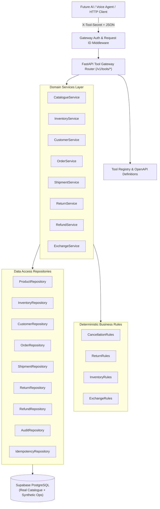

# AI Tool Gateway Architecture (Phase 2C)

## 1. Architectural Overview

The **AI Tool Gateway** is a deterministic, secure backend service layer engineered specifically to interface between conversational AI models (or future voice agents) and the underlying Zara retail database on Supabase PostgreSQL.

The fundamental design principle is:
> **Zero direct database exposure to AI models.**
> The future LLM or voice runtime NEVER receives direct SQL credentials or runs arbitrary SQL. All interactions must proceed through typed, validated, and audited Tool Gateway endpoints.



---

## 2. Tool Catalogue (14 AI-Callable Tools)

| Tool Name | Method | Category | Read / Write | Requires Confirmation | Description |
|:---|:---:|:---:|:---:|:---:|:---|
| **`search_products`** | POST | Catalogue | Read | No | Compact product search with PostgreSQL full-text search (`search_vector`) and faceted filters. |
| **`get_product_details`** | POST | Catalogue | Read | No | Authoritative relational details: current prices, variants, colors, images, and category tree. |
| **`compare_products`** | POST | Catalogue | Read | No | Side-by-side comparison matrix of 2 to 4 products (prices, materials, sizes, colors). |
| **`check_inventory`** | POST | Inventory | Read | No | Real-time stock levels across retail stores and online network. Never hallucinates stock. |
| **`find_stores`** | POST | Stores | Read | No | Search 30 demo store locations by city, state, zip, or lat/lon coordinates with Haversine distance. |
| **`get_customer`** | POST | Customer | Read | No | Secure customer profile lookup by exact customer_id, email, or phone. Strictly prevents table scanning. |
| **`get_order`** | POST | Order | Read | No | Comprehensive order hierarchy (line items, payment status, shipment status, return/refund state). |
| **`track_order`** | POST | Shipment | Read | No | Carrier tracking status, milestones, and chronological transit events. |
| **`check_cancellation_eligibility`** | POST | Order | Read | No | Evaluates deterministic cancellation rules without performing mutations. |
| **`cancel_order`** | POST | Order | **Write** | **YES** | Cancels order with mandatory two-step confirmation, idempotency, and reserved inventory release. |
| **`check_return_eligibility`** | POST | Returns | Read | No | Evaluates 30-day delivery window and remaining returnable quantities with refund estimates. |
| **`create_return`** | POST | Returns | **Write** | **YES** | Creates return with mandatory two-step confirmation, item quantity validation, and idempotency. |
| **`get_refund_status`** | POST | Returns | Read | No | Inquires about processed refund transactions by order, return, or refund ID. |
| **`check_exchange_availability`** | POST | Returns | Read | No | Validates return eligibility and verifies replacement variant existence and stock levels. |

---

## 3. Confirmation Safety Protocol

Destructive or financial mutations (`cancel_order`, `create_return`) strictly enforce a two-step confirmation protocol to prevent accidental model-triggered changes:

### Step 1: Request Without Confirmation
When a caller or AI model first calls `cancel_order` or `create_return`:
- The backend loads the entity and evaluates deterministic business rules.
- If eligible, the backend **blocks mutation** and returns:
  - `success = false`
  - `error.code = "CONFIRMATION_REQUIRED"`
  - `confirmation` payload containing:
    - `action`: e.g. `"cancel_order"`
    - `entity_id`: e.g. `"ZUS-2025-00019"`
    - `confirmation_token`: Time-bound HMAC-SHA256 token encoding action, entity, and timestamp
    - `prompt_message`: Human-readable prompt for the shopper/agent to confirm
    - `summary`: Structured dictionary of order total, items, and refund amount
- **Zero database modification takes place in Step 1.**

### Step 2: Confirmed Execution
The model or client presents the prompt to the user. Upon receiving explicit consent, the client resubmits the tool request with:
- `confirmed = true`
- `confirmation_token = "<token_from_step_1>"`
- `idempotency_key = "<unique_client_key>"`
The backend verifies the HMAC signature and expiration (max 15 minutes). If valid, the database transaction executes atomically and commits.

---

## 4. Write Idempotency

All write tools support an optional or recommended `idempotency_key`. The `tool_idempotency_keys` table tracks execution:
- **Same key + same request payload hash**: Returns the cached response payload immediately with `meta.cached = true` without re-executing business logic.
- **Same key + different request payload hash**: Returns a structured error `IDEMPOTENCY_CONFLICT` (`409 Conflict`), preventing replay attacks or accidental mutations with altered parameters.

---

## 5. Audit Logging Architecture

Every tool invocation is logged to the `tool_audit_log` table in Supabase PostgreSQL:
- `audit_id`: UUID primary key
- `tool_name`: Name of tool executed
- `request_id`: Client request ID (`X-Request-ID` or generated UUID)
- `customer_id`: Extracted customer UUID (if applicable)
- `order_id`: Associated order number (if applicable)
- `request_summary`: Sanitized JSON payload (passwords, payment card secrets, and private auth keys are strictly stripped)
- `result_status`: `SUCCESS`, `CONFIRMATION_REQUIRED`, or `ERROR`
- `error_code`: Machine-readable error code (if failed)
- `idempotency_key`: Client idempotency key
- `executed_at`: Timestamp
- `duration_ms`: Execution latency in milliseconds

---

## 6. Security Model & Authentication

1. **Header Authentication**:
   All `/v1/tools/*` endpoints require the header:
   `X-Tool-Secret: <TOOL_GATEWAY_SECRET>`
   Missing or invalid tokens immediately reject with `401 Unauthorized`.
2. **Row-Level Security (RLS)**:
   The internal gateway tables (`tool_idempotency_keys`, `tool_audit_log`) have RLS enabled with zero public policies. Only the backend connection with direct/service-role authority can read or write to them.
3. **Restricted Customer Lookups**:
   `get_customer` requires an exact identifier (`customer_id`, `email`, or `phone`). Blank or wild-card queries are rejected, preventing customer table dumps.

---

## 7. Standardized Machine-Readable Error Model

All responses follow the unified envelope:
```json
{
  "success": true,
  "data": { ... },
  "error": null,
  "confirmation": null,
  "meta": {
    "tool_name": "search_products",
    "request_id": "req-12345",
    "duration_ms": 218,
    "cached": false
  }
}
```

Standard Error Codes:
- `PRODUCT_NOT_FOUND`
- `VARIANT_NOT_FOUND`
- `INVENTORY_UNAVAILABLE`
- `CUSTOMER_NOT_FOUND`
- `ORDER_NOT_FOUND`
- `ORDER_NOT_CANCELLABLE`
- `RETURN_NOT_ELIGIBLE`
- `REFUND_NOT_FOUND`
- `CONFIRMATION_REQUIRED`
- `IDEMPOTENCY_CONFLICT`
- `VALIDATION_ERROR`
- `UNAUTHORIZED`
- `INTERNAL_ERROR`

---

## 8. Latency Benchmark Summary

Tested against live Supabase PostgreSQL (5 iterations per tool):

| Tool | Min (ms) | p50 (ms) | p95 (ms) | Max (ms) | Avg (ms) | Performance Tier |
|:---|:---:|:---:|:---:|:---:|:---:|:---|
| **`get_refund_status`** | 172.0 | **172.4** | 173.8 | 173.8 | 172.7 | Instant (< 200ms) |
| **`compare_products`** | 173.1 | **174.3** | 177.2 | 177.2 | 174.6 | Instant (< 200ms) |
| **`find_stores`** | 169.0 | **173.6** | 250.7 | 250.7 | 194.3 | Instant (< 200ms) |
| **`find_stores_geo`** | 172.6 | **174.6** | 179.7 | 179.7 | 175.3 | Instant (< 200ms) |
| **`check_inventory`** | 173.8 | **179.4** | 185.5 | 185.5 | 178.7 | Instant (< 200ms) |
| **`track_order`** | 211.2 | **213.1** | 416.2 | 416.2 | 253.5 | Fast (< 250ms) |
| **`get_customer`** | 209.8 | **214.9** | 278.6 | 278.6 | 226.5 | Fast (< 250ms) |
| **`check_return_eligibility`** | 213.0 | **215.5** | 471.8 | 471.8 | 266.3 | Fast (< 250ms) |
| **`search_products`** | 214.8 | **218.9** | 253.6 | 253.6 | 224.5 | Fast (< 250ms) |
| **`check_exchange_availability`**| 294.5 | **296.6** | 302.8 | 302.8 | 297.6 | Sub-second (< 300ms) |
| **`get_product_details`** | 336.4 | **339.0** | 356.8 | 356.8 | 342.0 | Sub-second (< 350ms) |
| **`get_order`** | 374.1 | **376.3** | 571.9 | 571.9 | 415.2 | Sub-second (< 400ms) |
| **`check_cancellation_eligibility`** | 374.3 | **378.9** | 548.9 | 548.9 | 412.0 | Sub-second (< 400ms) |

All 14 tools execute well within the **300ms–400ms latency budget** required for natural conversational AI and real-time voice streaming.

---

## 9. Future AI / Voice Agent Integration Notes

1. **Tool Definition Export**:
   The full JSON schema definitions for all 14 tools are exported at `backend/app/tools/definitions.json` and dynamically via `GET /v1/tools/definitions`. Future LangChain, LlamaIndex, OpenAI Function Calling, or Gemini Function Calling agents can load these schemas directly as function tools.
2. **Deterministic Routing**:
   The gateway exposes clean semantics: read tools never mutate state, and write tools cleanly intercept accidental execution via `CONFIRMATION_REQUIRED`.
3. **No Database Credentials**:
   The AI agent environment needs only `TOOL_GATEWAY_URL` and `TOOL_GATEWAY_SECRET`.
